# Using RNN Classification to Solve Simple Substitution Ciphers

**Authors:** David Hamilton, Anosh Askari, and Varma Indukuri

This README is a Markdown version of the final report, adapted for repository use while retaining the original figures.

---

## Abstract

Substitution ciphers are among the oldest cryptographic techniques, and methods for breaking them date back to around 850 CE. Traditional decryption usually relies on frequency analysis and letter-pattern recognition, but those approaches are difficult to translate directly into strong modern computational methods.

This project uses machine learning to address that challenge. We trained **bidirectional GRU** and **bidirectional LSTM** models to predict unknown letters in text ranging from fully encrypted to partially decrypted. These recurrent neural networks are combined with a **dynamic search algorithm** that explores likely guesses until the full cipher is decoded.

Using processed data from the **Brown Corpus** in NLTK, the final models achieved **validation and test accuracies near or above 89.5%** on stepwise letter-classification tasks. For complete decryption, we tested on external cryptograms from the Razzle Puzzles cryptogram API. Results were mixed: some ciphers were fully solved, while others were only partially decrypted. Longer sentences generally produced better results, while short ciphers and those containing uncommon letters such as `z`, `q`, `j`, and `x` were harder for the models.

Future improvements would likely come from adding more examples containing rare letters and improving the search procedure used during full decipherment.

---

## Introduction

A simple substitution cipher replaces each plaintext letter with a letter from a shuffled alphabet, producing ciphertext. Breaking such a cipher is difficult because the system must recover meaning from context and letter patterns rather than direct mappings.

This project explores a modern approach using **recurrent neural networks (RNNs)** and a search procedure to automate decipherment. Our models use **bidirectional GRUs and LSTMs**, which are well-suited for sequence data and can use both past and future context when predicting unknown letters.

To recover plaintext efficiently, we reorder the partially deciphered text based on the number of unique undeciphered letters remaining, then predict the most promising next letter. For full decoding, we use a search procedure that combines ideas from **Expectimax** and **Dijkstra-style priority expansion**, selecting the most probable partial states as the search continues.

Related work has used large LSTM-only approaches with beam-search variants. In contrast, our work uses smaller bidirectional architectures and a search strategy tailored to the decipherment pipeline.

---

## Dataset Statistics

The dataset was built from the **Brown Corpus** through NLTK. During preprocessing:

- all characters except letters and apostrophes were removed,
- sentences with unique-word lengths below 10 or above 250 were removed,
- the remaining corpus was shuffled and split into **80% train / 10% validation / 10% test**.

That produced:

- **43,689** training sentences
- **5,461** validation sentences
- **5,462** testing sentences

Each sentence was then encrypted with **3 unique cipher keys**, and every step of the decipherment process was added as a separate training example.

### Example cipher-generation process

**Provided sentence:**

> i think it’s a good day for a walk don’t you

**Step 1 – Encrypt the plaintext**

> G CZGST GC'B M VHHY YMP EHO M WMKT YHS'C PHX

**Step 2 – Remove duplicated words**

> G CZGST GC'B M VHHY YMP EHO WMKT YHS'C PHX

**Step 3 – Sort word order by number of unique unciphered letters**

> G M GC’B VHHY YMP EHO PHX WMKT YHS’C CZGST

**Step 4 – Replace most common unciphered letter in first eligible word with an underscore**

> _ M _C’B VHHY YMP EHO PHX WMKT YHS’C CZ_ST,i

**Step 5 – Replace underscore with class and resort word order**

> i M iC’B VHHY YMP EHO PHX WMKT YHS’C CZiST

**Step 6 – Repeat until all steps are generated**

**Resulting ciphers generated:**

1. `_ M _C’B VHHY YMP EHO PHX WMKT YHS’C CZ_ST,i`
2. `i _ iC’B VHHY Y_P EHO PHX W_KT YHS’C CZiST,a`
3. `i a i_’B YaP VHHY EHO PHX WaKT YHS’_ _ZiST,t`
4. `i a it’_ YaP VHHY EHO PHX WaKT YHS’t tZiST,s`
5. `i a it’s _aP VHH_ EHO PHX WaKT _HS’t tZiST,d`
6. `i a it’s da_ VHHd dHS’t EHO _HX WaKT tZiST,y`
7. `i a it’s day V__d d_S’t y_X E_O WaKT tZiST,o`
8. `i a it’s day _ood doS’t yoX EoO WaKT tZiST,g`
9. `i a it’s day good do_’t yoX EoO WaKT tZi_T,n`
10. `i a it’s day good don’t yo_ EoO tZinT WaKT,u`
11. `i a it’s day good don’t you _oO tZinT WaKT,f`
12. `i a it’s day good don’t you fo_ tZinT WaKT,r`
13. `i a it’s day good don’t you for tZin_ WaK_,k`
14. `i a it’s day good don’t you for t_ink WaKk,h`
15. `i a it’s day good don’t you for think _aKk,w`
16. `i a it’s day good don’t you for think wa_k,l`

Because each sentence was encrypted three times, one sentence like this generated **48 total samples**.

This expanded the dataset sizes to:

- **Training:** 2,381,889
- **Validation:** 297,324
- **Testing:** 297,591

### Class-frequency figures

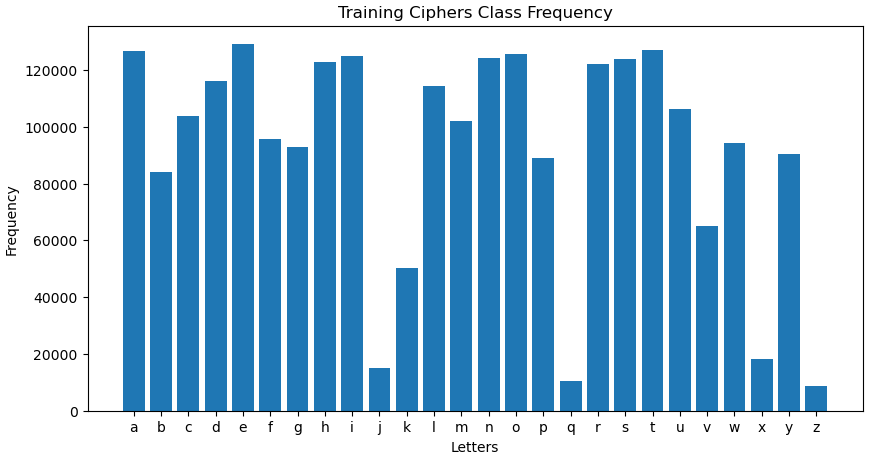
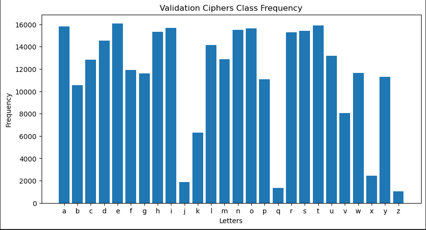
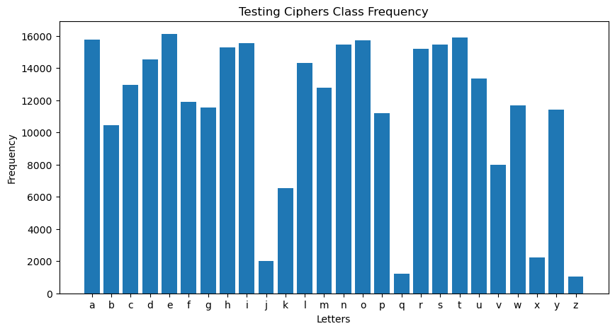

### Cipher-length distributions

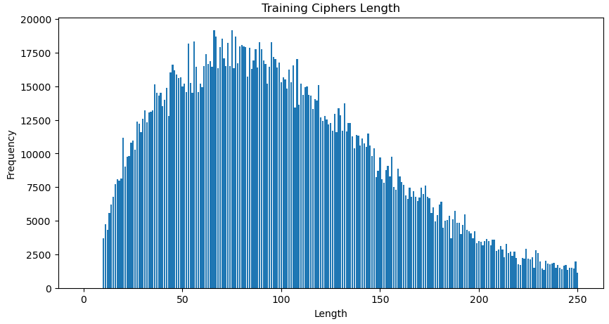
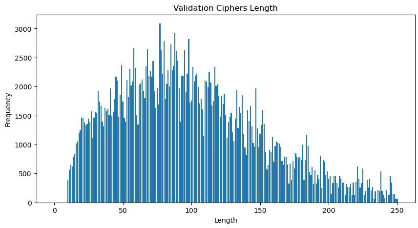
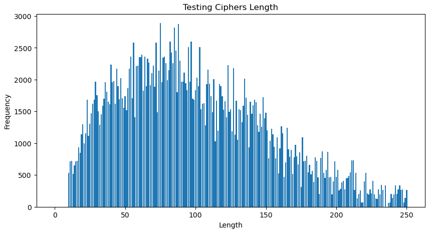

---

## Complete-Decipherment Test Set

To evaluate end-to-end decipherment, we used **22 cases not found in the Brown Corpus**, mostly taken from the Razzle Puzzles cryptogram source that inspired the project. Each sentence was used in two forms:

- a ciphered version,
- the plaintext version written in all caps so the model would treat it as encrypted.

This produced **44 total evaluation cases**.

- Longest processed test case: **168 characters**
- Shortest processed test case: **17 characters**
- Most test cases fell between **50 and 125 characters**

The team later discovered that the models performed very poorly on sentences containing **all letters of the alphabet**, so the final test set was curated accordingly.

### Complete-decipherment test-case letter frequency

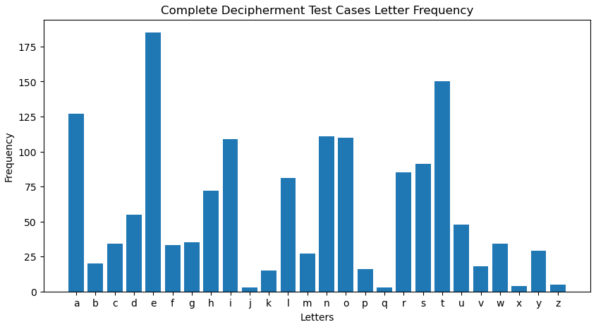

---

## Model

The models were built with **Keras Sequential** and followed this structure:

1. **Embedding layer** for character inputs
2. **Bidirectional LSTM or GRU layer**
3. **Dense output layer of size 27** using categorical cross entropy

The output layer used **27 classes** rather than 26 because with 26 outputs, the letter `a` was never classified correctly. Expanding the output size fixed that issue during the project.

### LSTM (Long Short-Term Memory)

LSTMs help avoid the long-term dependency problem in standard RNNs by maintaining a memory cell controlled by gates:

- **Forget gate**: decides what information to discard
- **Input gate**: decides what new information to store
- **Output gate**: decides what hidden state to expose for prediction

#### LSTM diagram

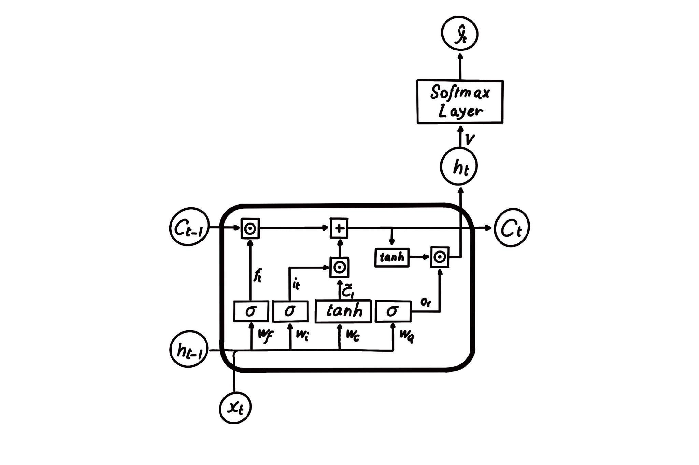

#### LSTM equations

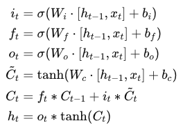

### GRU (Gated Recurrent Unit)

GRUs simplify the LSTM by combining the forget and input gates into a single **update gate** and merging the cell state with the hidden state. This reduces the number of tensor operations while keeping strong sequence modeling behavior.

#### GRU equations

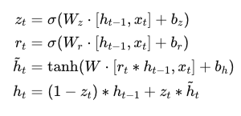

#### GRU diagram

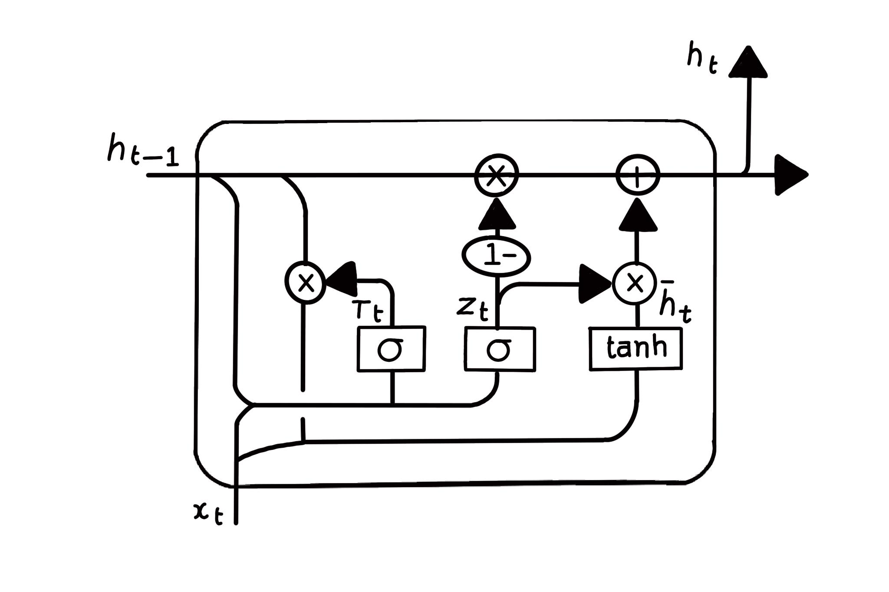

### Configuration summary

The models used:

- an **embedding layer** to encode character inputs into dense vectors,
- a **bidirectional LSTM/GRU layer** to process context in both directions,
- a **dense output layer** that predicts probabilities over 27 classes.

The objective function was **categorical cross entropy**, appropriate for multi-class letter classification.

### Search algorithm

The search procedure combines ideas from **Dijkstra’s algorithm** and **Expectimax**:

- all possible partial decipherment states are tracked,
- the priority queue stores the state likelihood, partially deciphered text, and current key,
- the next expanded state is the most probable one seen so far.

The algorithm also keeps track of already-deciphered letters so they are not re-predicted, and it can accept a partially known key without breaking the decipherment process.

---

## Experimental Setup

Because of the large number of samples, training used:

- **batch size:** 1024
- **optimizer:** Adam
- **embedding dimensions searched:** 64, 128, 256
- **RNN unit sizes searched:** 64, 128, 256
- **epochs:** up to 30 per model
- **early stopping:** monitored training loss
- **checkpoint selection:** lowest validation loss

Since both LSTM and GRU variants were tested across the grid, the team trained **18 models** total.

---

## GRU Optimization Results

| Embedding | RNN Units | Best Epoch | Training (acc, loss) | Validation (acc, loss) | Testing (acc, loss) |
|---|---:|---:|---|---|---|
| 64 | 64 | 30 | (0.9012, 0.2983) | (0.8869, 0.3472) | (0.8842, 0.3577) |
| 64 | 128 | 8 | (0.9082, 0.2789) | (0.8887, 0.3474) | (0.8842, 0.3577) |
| 64 | 256 | 5 | (0.9168, 0.2518) | (0.8904, 0.3454) | (0.8876, 0.3568) |
| 128 | 64 | 29 | (0.9029, 0.2932) | (0.8867, 0.3495) | (0.8846, 0.3582) |
| 128 | 128 | 7 | (0.9156, 0.2550) | (0.8958, 0.3248) | (0.8930, 0.3346) |
| 128 | 256 | 5 | (0.9191, 0.2438) | (0.8923, 0.3375) | (0.8904, 0.3462) |
| 256 | 64 | 30 | (0.9020, 0.2957) | (0.8868, 0.3468) | (0.8847, 0.3580) |
| 256 | 128 | 11 | (0.9249, 0.2259) | (0.8930, 0.3412) | (0.8912, 0.3498) |
| 256 | 256 | 4 | (0.9138, 0.2609) | (0.8917, 0.3370) | (0.8886, 0.3484) |

---

## LSTM Optimization Results

| Embedding | RNN Units | Best Epoch | Training (acc, loss) | Validation (acc, loss) | Testing (acc, loss) |
|---|---:|---:|---|---|---|
| 64 | 64 | 28 | (0.8861, 0.3488) | (0.8726, 0.3927) | (0.8696, 0.4066) |
| 64 | 128 | 13 | (0.9036, 0.2914) | (0.8848, 0.3561) | (0.8826, 0.3672) |
| 64 | 256 | 6 | (0.9191, 0.2434) | (0.8929, 0.3414) | (0.8905, 0.3486) |
| 128 | 64 | 30 | (0.9000, 0.3020) | (0.8833, 0.3643) | (0.8808, 0.3730) |
| 128 | 128 | 13 | (0.9156, 0.2540) | (0.8910, 0.3409) | (0.8886, 0.3509) |
| 128 | 256 | 6 | (0.9261, 0.2219) | (0.8967, 0.3335) | (0.8930, 0.3441) |
| 256 | 64 | 29 | (0.8973, 0.3112) | (0.8814, 0.3649) | (0.8782, 0.3786) |
| 256 | 128 | 10 | (0.9082, 0.2762) | (0.8889, 0.3441) | (0.8873, 0.3510) |
| 256 | 256 | 6 | (0.9304, 0.2087) | (0.8917, 0.3278) | (0.8944, 0.3385) |

### Training/validation curves from top models

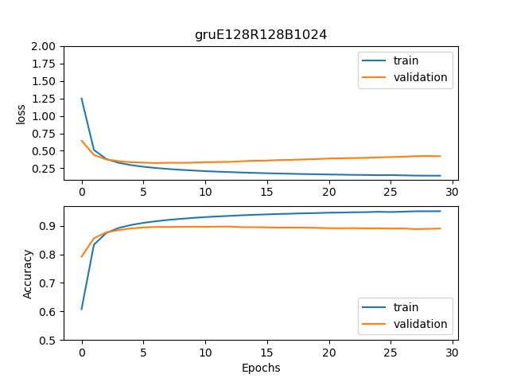
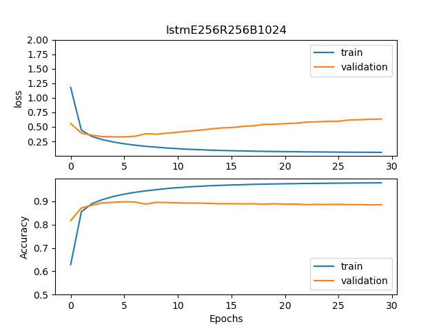
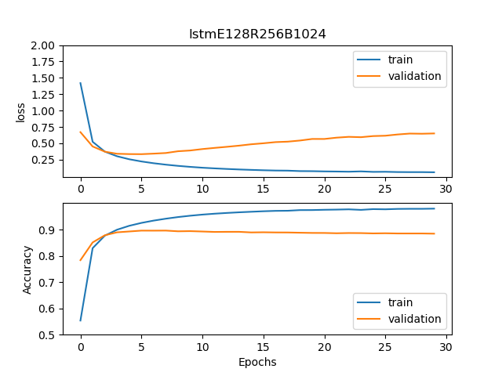

---

## Further Optimization

The three top models were selected for another round of optimization:

- **GRU E128 R128** at epoch 7
- **LSTM E256 R128** at epoch 6
- **LSTM E256 R256** at epoch 6

A second grid search used:

- **learning rates:** `1e-7`, `5e-7`, `1e-6`, `5e-6`
- **weight decay values:** `0.95`, `0.99`, `0.9999`
- **epochs:** 10

This improved stepwise validation/testing accuracy and lowered validation/testing loss for all three models.

### Before vs after further optimization

| Model | Before | After |
|---|---|---|
| **GRU E128 R128** | Training: (0.9156, 0.2550)  Validation: (0.8958, 0.3248)  Testing: (0.8930, 0.3346) | Training: (0.9233, 0.2328)  Validation: (0.8970, 0.3205)  Testing: (0.8944, 0.3301) |
| **LSTM E256 R128** | Training: (0.9261, 0.2219)  Validation: (0.8967, 0.3335)  Testing: (0.8930, 0.3441) | Training: (0.9375, 0.1905)  Validation: (0.8987, 0.3263)  Testing: (0.8948, 0.3374) |
| **LSTM E256 R256** | Training: (0.9304, 0.2087)  Validation: (0.8917, 0.3278)  Testing: (0.8944, 0.3385) | Training: (0.9423, 0.1759)  Validation: (0.8999, 0.3219)  Testing: (0.8966, 0.3327) |

---

## End-to-End Decipherment Results

The six selected models (before and after further optimization) were evaluated on the **44 complete-decipherment test cases**.

A surprising outcome was that the **further-trained models often performed worse in full start-to-finish decoding**, even though they improved at the stepwise letter-classification task.

### Main observations

- The **LSTM E256 R128 Before** model was the strongest overall full-decipherment model.
- It matched or exceeded the others on nearly every test case except **18, 34, 37, and 41**.
- The **GRU Before** model did slightly better on case **41**.
- All models struggled badly with case **37**, with the **GRU After** model reaching only four correct letters.
- Cases **42** and **43** were successfully decrypted by all models with the top guess.
- The hardest cases were short examples with rare letters, especially:
  - **“LIFE IS A ZOO IN A JUNGLE”**
  - its ciphered pair: **“TMFJ MN P CGG MU P HDUWTJ”**

### GRU E128 R128 – before and after

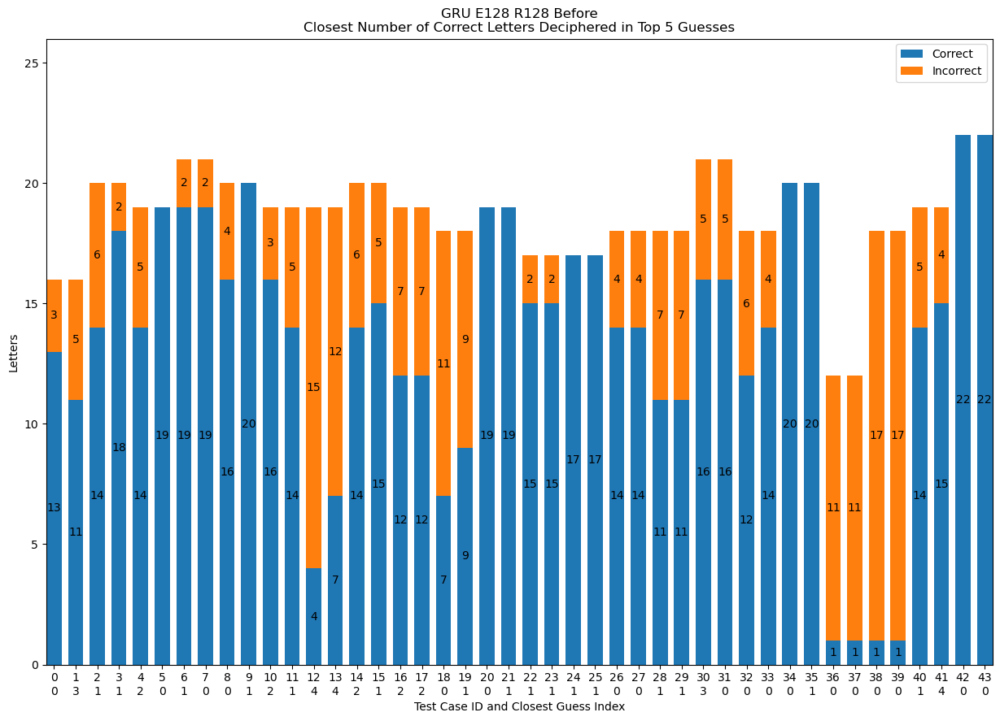
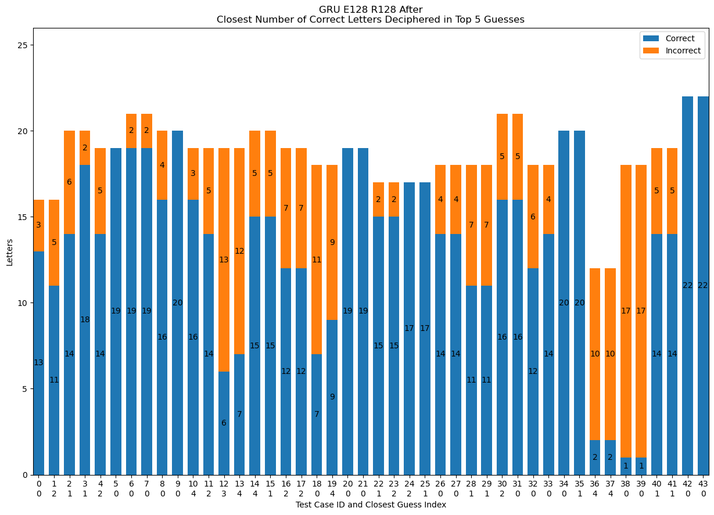

### LSTM E256 R128 – before and after

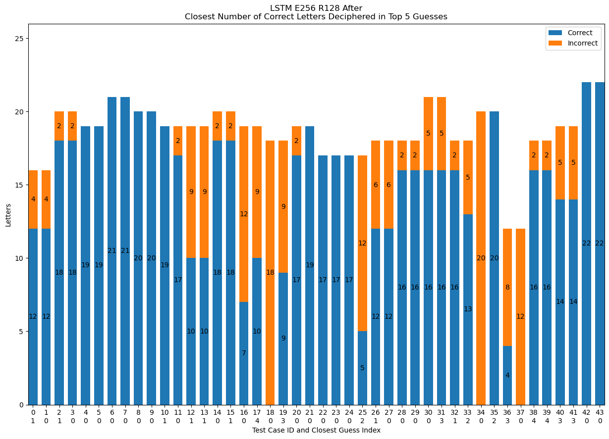
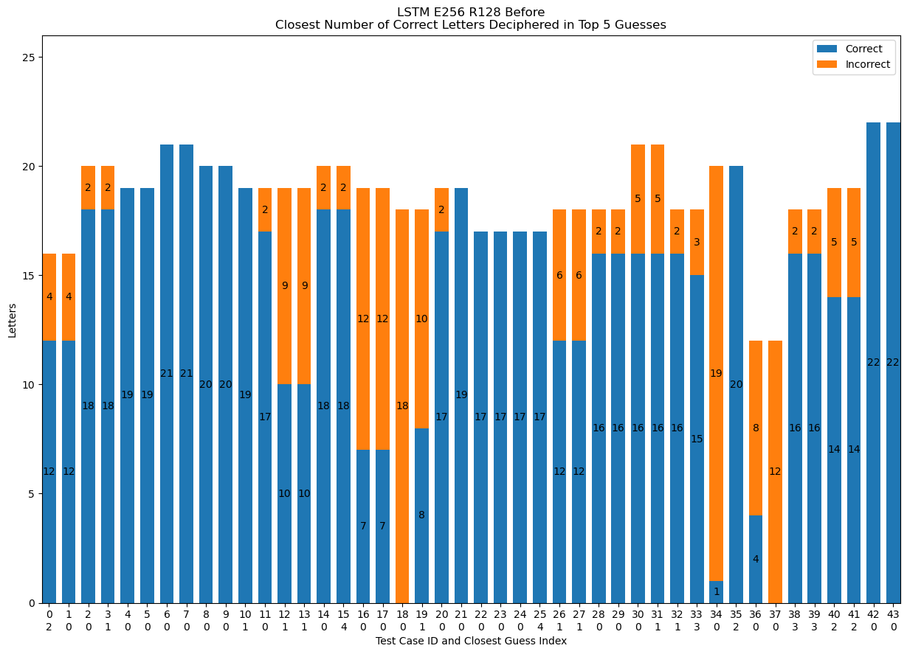

### LSTM E256 R256 – before and after

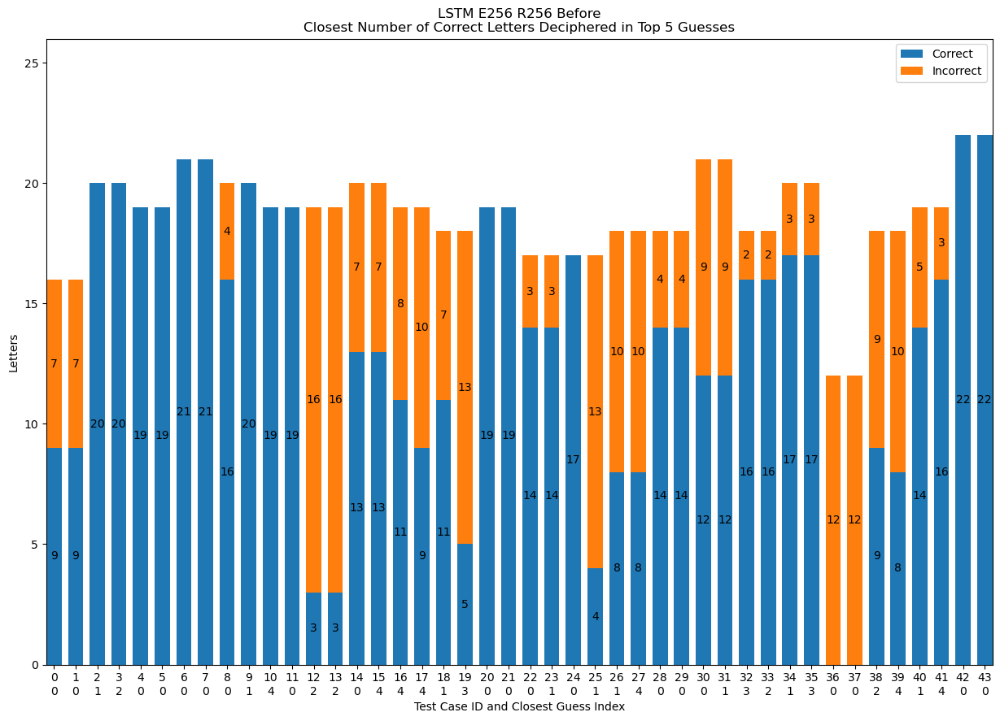
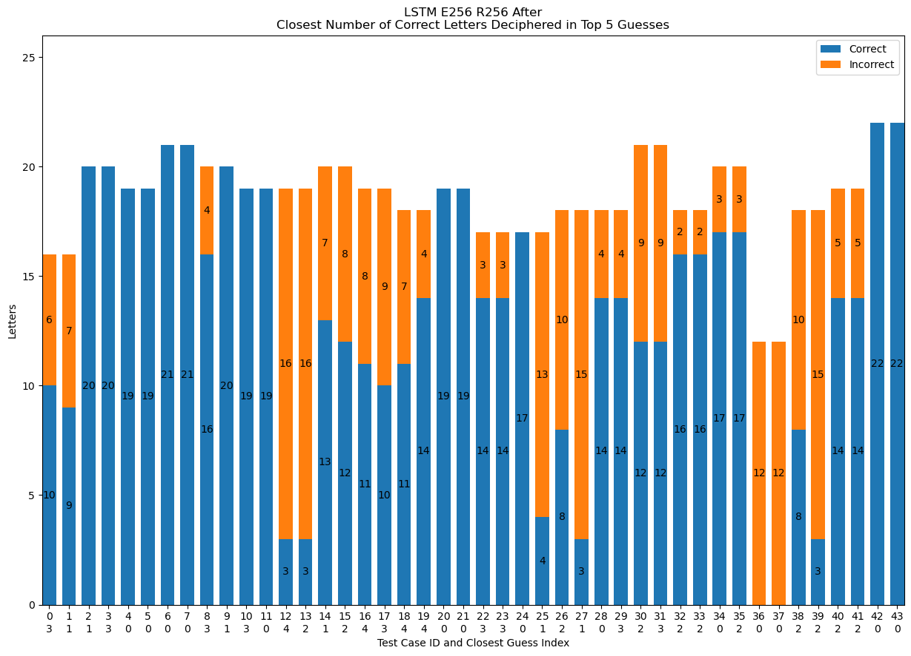

---

## Discussion and Conclusion

This project provided extensive hands-on experience with optimizing **LSTM** and **GRU** models for sequence classification and cipher decipherment.

Although the further-trained models performed worse on the curated end-to-end decipherment test set, they still performed better at **classifying individual decipherment steps**. More testing would be needed to confirm whether the drop in complete-decoding quality was specific to the `final_tests` set.

### Key lessons learned

#### 1. Data leakage issue discovered and fixed

An early mistake occurred when the train/validation/test split was done **after** generating cipher steps. That caused different stages of the same cipher to appear across all three sets, producing misleading accuracies around **97%**. The fix was to split the raw sentences first and generate ciphers afterward.

#### 2. Pangram-like cases were extremely difficult

The models struggled heavily with sentences containing all letters of the alphabet. One example was:

> A quick brown fox jumped over the lazy dog

After two hours of decipherment attempts, the model still did not finish. Providing a single solved letter reduced runtime to about fifteen minutes, but the case remained difficult.

### Future improvements

The report suggests several directions:

1. **Add more sentences containing rare letters** (`z`, `q`, `x`, `j`) to improve rare-class prediction.
2. **Improve decipherment order selection** by choosing the most informative undeciphered letter across tied candidate words instead of always taking the first eligible word.
3. **Train a second model to choose the next best letter to decode**, rather than only predicting letter identity.
4. **Add a heuristic to the search algorithm**, such as remaining undeciphered letters, to reduce computation time.

A heuristic was tested, but it made rare letters easier to miss. With a better-balanced training corpus, however, that idea could still be useful.

---

## References

1. N. Kambhatla, A. Bigvand, and A. Sarkar, **“Decipherment of Substitution Ciphers with Neural Language Models,”** 2018. Available in the original report.

---

## Source

Converted from the project final report PDF.
